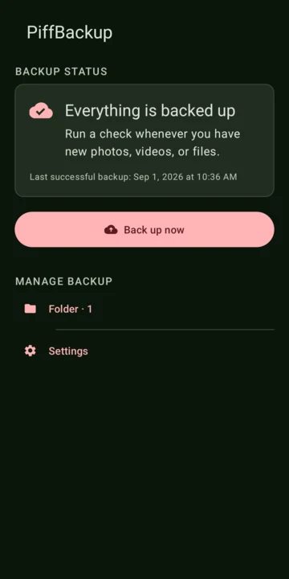

<p align="center">
  
</p>

<h1 align="center">PiffBackup</h1>

<p align="center">
  A focused, non-destructive Android backup client for a private Hetzner Storage Box.
</p>

PiffBackup backs up selected folders from an Android device while preserving their
relative directory structure. It can adopt an existing remote collection, upload
only new or changed files on later runs, and safely pause and resume background
work.

The current release is intentionally narrow: Android 13 or newer, ARM64 devices,
and Hetzner Storage Box accounts using SSH/rsync. It is designed for direct APK
installation rather than Google Play distribution.

<p align="center">
  
</p>

## Highlights

- One-way, non-destructive backups with no remote deletion path.
- Any number of selected local folders and explicit remote folder mappings.
- Safe adoption of an existing collection using an rsync dry-run preview before
  the first upload.
- Efficient incremental discovery for media and general files.
- Durable background work with progress notifications and Pause/Resume.
- A compact live activity panel showing the most recent files being uploaded.
- Password-once onboarding with a dedicated SSH key, strict host-key pinning,
  and Android Keystore-backed credential protection.
- Material 3 UI with dark mode, Android themed icons, accessibility semantics,
  and English and Italian translations.
- No analytics SDK, advertising SDK, or cloud account operated by PiffBackup.

## How it works

1. Connect a Hetzner Storage Box and select an existing top-level backup folder.
2. Choose one or more Android folders and map each one to a destination below
   that backup folder.
3. Review the initial comparison summary and explicitly start the first upload.
4. Use **Back up now** for later checks. PiffBackup stages an immutable file list,
   uploads new or changed files, and advances its checkpoint only after success.

Transfers are deliberately one-way. Removing a file from the phone does not remove
the remote copy, and PiffBackup never invokes rsync deletion options.

## Requirements and limitations

- Android 13 / API 33 or newer.
- An `arm64-v8a` device.
- A Hetzner Storage Box with SSH support and external reachability enabled.
- Direct installation of the APK and the Android **All files access** permission.
- Uploads are currently sequential and require a network connection.
- The current transport is specific to Hetzner's SSH/rsync setup on port 23.

PiffBackup is backup software, but it should not be the only copy of important
data. Test a small folder first and periodically verify that remote files can be
restored.

## Build from source

Prerequisites:

- Android Studio with Android Gradle Plugin 9.3.2 support.
- JDK 17 or newer; Android Studio's bundled JBR works.
- Android SDK API 37.
- Android NDK 28.2.13676358 only when rebuilding the bundled native tools.

The repository includes the ARM64 native executables used by the application.
Build and verify the Android project with:

```bash
./gradlew testDebugUnitTest lintDebug assembleDebug
```

Create the optimized release artifact with:

```bash
./gradlew assembleRelease
```

The release output is unsigned. Configure your own signing identity outside the
repository before distributing an APK. To reproduce the bundled rsync and
Dropbear executables from pinned upstream archives, see
[`tools/native/README.md`](tools/native/README.md).

## Continuous integration and releases

[`android.yml`](.github/workflows/android.yml) runs the unit tests, Android lint,
debug build, Android-test compilation, and optimized release build for every
push and pull request. The resulting debug and unsigned release APKs are retained
as short-lived workflow artifacts.

Pushing a semantic-version tag such as `v1.2.3` or `v1.2.3-beta.1` also builds,
signs, and verifies an APK, generates its SHA-256 checksum, and creates a GitHub
Release with generated release notes. Beta tags are marked as GitHub
prereleases. Configure these GitHub Actions repository secrets before pushing a
release tag:

| Secret | Value |
| --- | --- |
| `PIFFBACKUP_KEYSTORE_BASE64` | The release keystore encoded as one base64 line |
| `PIFFBACKUP_KEYSTORE_PASSWORD` | Keystore password |
| `PIFFBACKUP_KEY_ALIAS` | Signing-key alias |
| `PIFFBACKUP_KEY_PASSWORD` | Signing-key password |

On macOS, create the base64 value without writing a second credential file:

```bash
base64 < /path/to/release.keystore | tr -d '\n'
```

Keep the original keystore and passwords in a separate, backed-up secret store.
Losing the signing key prevents compatible upgrades to previously installed
releases. Once the secrets are configured, publish a release with:

```bash
git tag v1.2.3-beta.1
git push origin v1.2.3-beta.1
```

## Security and privacy

- The Storage Box password is used only during initial key installation and is
  not persisted.
- The dedicated private key is encrypted with AES-256-GCM using a non-exportable
  Android Keystore key. Decrypted temporary files are owner-only and removed
  after use.
- Server identity is pinned and a changed host key fails closed.
- App-private databases, preferences, and credentials are excluded from Android
  backup and device transfer.
- Release diagnostics do not log credentials, remote paths, or personal
  filenames. The on-screen transfer list is bounded, in-memory, and not saved.
- Generated signing files, environment files, keys, APKs, and bundles are ignored
  by Git.

Please read [`SECURITY.md`](SECURITY.md) before reporting a vulnerability. Do not
attach real credentials, server fingerprints, logs containing personal paths, or
private filenames to a public issue.

## Project structure

```text
app/src/main/          Android application, resources, and bundled ARM64 tools
app/src/test/          Host-side unit tests
app/src/androidTest/   Local-only Android instrumentation tests
artwork/               Editable vector brand source
docs/images/           Sanitized README imagery
tools/native/          Reproducible rsync and Dropbear build scripts
```

The application uses XML Views with ViewBinding, Room for durable state,
WorkManager on Android 13, user-initiated `JobService` work on newer Android
versions, and packaged rsync/Dropbear executables for file transfer.

Historical implementation and verification notes are retained in the root
`PHASE*.md` documents, with the original engineering specification under
`reference/`.

## TODO

- Introduce a provider abstraction and support additional cloud backup services.
- Add straightforward self-hosted targets, including common SFTP/rsync,
  WebDAV, and S3-compatible setups where the safety model can be preserved.
- Make setup even simpler with guided presets, clearer connection diagnostics,
  and portable configuration handoff without exposing credentials.
- Support private at-home synchronization between phones, desktops, NAS devices,
  and other local machines, with secure LAN discovery and explicit conflict rules.
- Add additional Android CPU architectures.

## Third-party software

PiffBackup packages rsync, Dropbear, and several JVM dependencies. Versions,
source locations, checksums, and required notices are documented in
[`THIRD_PARTY_NOTICES.md`](THIRD_PARTY_NOTICES.md).

## License

PiffBackup's original source code is available under the [MIT License](LICENSE).
Bundled third-party software remains subject to the separate licenses documented
in [`THIRD_PARTY_NOTICES.md`](THIRD_PARTY_NOTICES.md).
