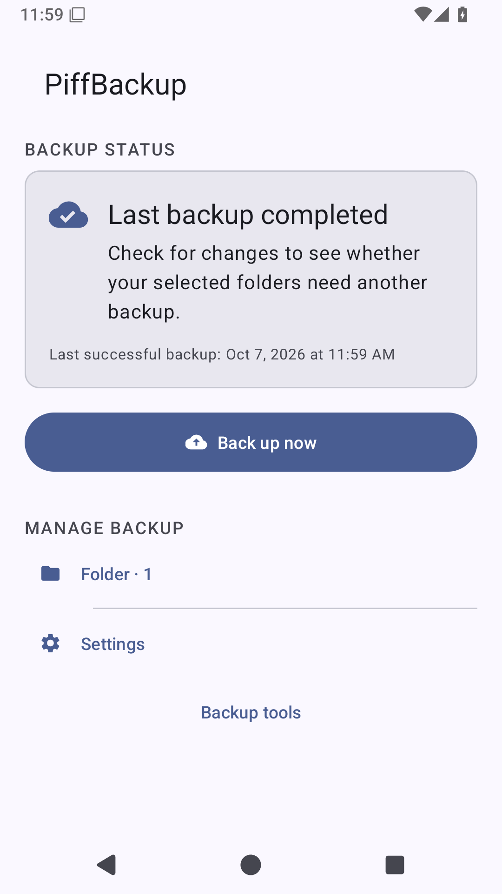
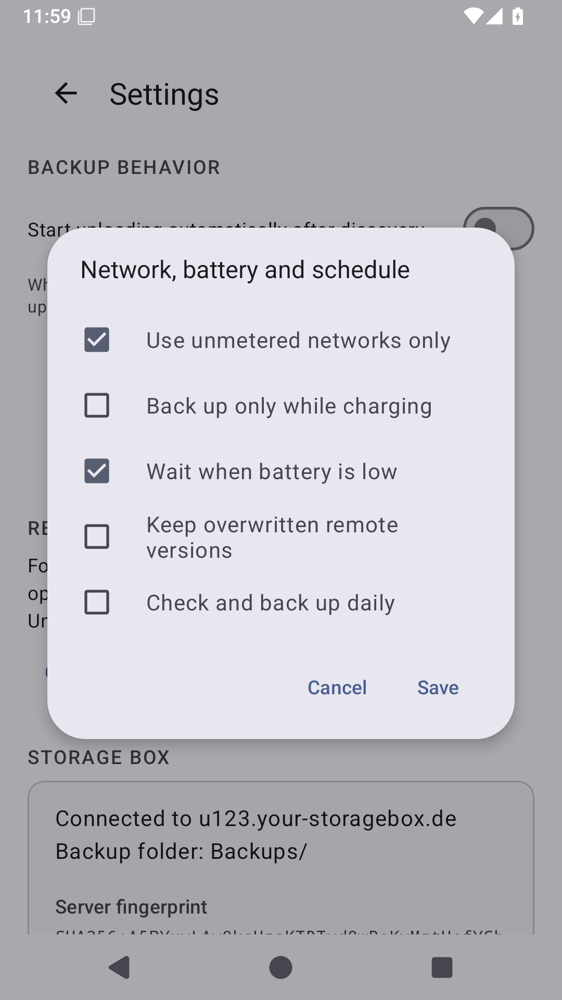

# Review implementation — 7 October 2026

This change implements the correctness fixes and product features identified in
[the baseline review](APP_REVIEW_2026-10-07.md). That review refers to commit
`58d5d00`; its line references describe the original code, not this working tree.

## Correctness and recovery

| Review finding | Result |
| --- | --- |
| Reconciliation could acknowledge same-size stale content | Explicit comparison policies: initial adoption retains the disclosed size-match policy; reconciliation uses checksums. A persisted baseline prevents history pruning from reverting to initial adoption. |
| Discovery and rsync disagreed on subsecond changes | Checksum comparison for selected incremental candidates, with delta transfer enabled. |
| Files changing after preview could be silently baselined | Preview captures content-bound metadata, confirmation validates it, and nonempty roots remain durable transfer work even when the preview reported no uploads. Changed reconciliation sources cannot advance the checkpoint. |
| Activity recreation and empty previews could crash | Rendering builds complete state and has an explicit no-work branch. Connection drafts survive recreation; passwords are not saved. |
| First upload bypassed durable execution | Adoption and reconciliation are persisted job kinds using the same background executor and checkpoint rules as incremental uploads. |
| Missing staged files caused endless retries | Bounded attempts, actionable error categories, and discard/reconcile recovery. Partial transfers remain failures. |
| Old failures remained current | Successful recovery supersedes old problems while retaining bounded history; obsolete staging files are cleaned. |
| Returning to the activity showed old state | Room-backed ViewModel observations and resume refresh. A navigation generation prevents an old refresh from navigating away from Settings. |
| Cancellation could miss a native process | Registration rechecks stop intent; interruptible execution, owned process groups, bounded pipe draining, and asynchronous cancellation. |
| Interrupted enrollment mutated active connection state | New credentials/known-host staging are committed after verification. Enrollment requires the expected server fingerprint before password authentication. |
| Home claimed unobserved current coverage | “Last backup completed” describes history. Check, upload, and verification times are separate; verification scope is explicit. |

New PBM3 metadata sidecars bind their records and staged file lists with SHA-256,
require a complete footer/count, reject trailing data, and preserve legacy readers.
Corruption during application rolls back the Room transaction. Streamed UTF-8
decoding preserves filenames split across reads. Observer exceptions cannot stop
pipe draining. Startup recovery runs off the main thread and gates operations.

Uploaded counts come from rsync records emitted after file transfer, rather than
planned totals. Uploaded bytes are logical file bytes, not measured SSH network
traffic. Repeated transfer attempts can count a file more than once. Diagnostics
retain sanitized error categories; history does not include passwords or keys.

## Features and where to find them

| Feature | Entry point and behavior |
| --- | --- |
| Restore | Home → Backup tools. Browse and restore a file/folder into a fresh `PiffBackup-restored-*` directory. A final checksum comparison detects conflicts; retries retain existing files. |
| Verification | Backup tools → Verify backup. Choose a mapping and sample up to 100 files or compare every selected local file. Verification does not advance the upload checkpoint. |
| History and coverage | Backup tools → Backup history / Folder status. Shows upload/comparison counts, failure help, pending/unavailable folders, media-only scope, and per-folder check/verification times. |
| Background policy | Settings → Backup preferences. Unmetered network, charging, battery-not-low, version preservation, and daily discovery. Defaults require unmetered networking and battery-not-low. |
| Scheduled backups | Daily discovery uses constrained periodic WorkManager work. Manual transfers use UIDT on supported Android versions and WorkManager on API 33. Queued work is distinct from transferring. |
| Exclusions | Settings → Exclusions. Relative glob rules and hidden-file controls. Changes invalidate the baseline transactionally and require renewed comparison. Rsync staging/version directories are always excluded. |
| Previous versions | Enable version preservation in preferences. Replaced files are retained below `.piffbackup-versions/<job-id>`; remote versions are not automatically deleted. |
| Device replacement | Export/import configuration from Backup tools. Exports include mappings, public server identity, provider, and selection policy. They contain no private credentials; import requires reenrollment and local-path review. |
| SSH key management | Verify the fingerprint during connection setup. Change connection can rotate the device key. Backup tools displays the public key and guidance for revoking the old/lost device key on the server. |
| Additional targets | Connection provider selector supports Hetzner Storage Box and compatible generic SSH/rsync servers, including NAS targets, with configurable port. |
| Removable storage | Mounted primary/SD storage can be mapped with All files access. Removable folders use All-files mode; inaccessible Android data/obb trees are rejected. |
| Broader devices | Native tools are packaged for ARM64, ARMv7, x86_64, and x86. Build scripts select and validate the corresponding ELF architecture. |
| Document providers | Encrypted snapshots offer the system document-tree picker. Content is streamed through the document API rather than represented as a native filesystem path. |
| Encrypted archives | Backup tools → Encrypted snapshots. Export the recovery key before creating snapshots. Ciphertext `.pba` archives are stored under the remote `Encrypted` directory and use durable operations. |
| Local staging usage | Backup tools reports private backup staging usage and cleans completed-job artifacts. |

Restore, verification, and archive operations have persistent state and restart
recovery. Discarded/failed terminal operations cannot be restarted by stale
scheduler callbacks. No transfer or recovery path invokes remote deletion.

## Encrypted archive recovery contract

PBA1 uses a random per-archive salt, a derived AES-256 key, and independently
authenticated 64 KiB GCM frames. Length, archive header, and sequence number are
authenticated. An authenticated end frame and exact EOF detect truncation and
trailing bytes. Authentication completes before ZIP extraction publishes restored
files. Extraction rejects escaping paths and conflicting existing files.

The recovery export contains a 32-byte key under the label
`PiffBackup archive recovery key v1`. Keep it offline and separate from the server.
It is deliberately excluded from configuration exports. A replacement phone must
import the recovery key before restoring archives. A device currently uses one
archive key; importing does not silently replace an installed key.

Snapshots require local temporary space for ciphertext. Restore additionally
requires a private plaintext ZIP while authentication/extraction completes. Normal
rsync backups are not client-side encrypted by enabling this separate workflow.

## Validation

Final results:

- **83 JVM tests passed**, zero failures/errors.
- **31 instrumentation tests passed on API 33**, ARM64 Android 13.
- **31 instrumentation tests passed on API 35**, ARM64 Android 15.
- Debug APK, instrumentation APK, and minified release APK built successfully.
- Lint: zero errors, 26 warnings. Warnings include dependency update suggestions,
  existing layout/resource findings, KTX/style suggestions, and a certificate
  trust-manager finding in the Bouncy Castle dependency. This is not a claim of a
  warning-free or independently audited application.
- Room v1→v2 migration preserves an existing profile and checkpoint. Device tests
  cover native child cancellation, split UTF-8, nonzero exits, same-size checksums,
  version preservation, document-provider encrypted round trips, and UI recreation
  and scrolling. JVM tests cover corruption, authentication, exclusions, and
  command safety.
- Both APKs contain all four ABI directories and all 16 native executables.
  English/Italian string keys match, with no duplicate keys. `git diff --check`
  passes.

The final local rsync benchmark on Android 15 produced:

| Scenario | Whole-file literal bytes | Delta literal bytes | Whole / delta process time |
| --- | ---: | ---: | ---: |
| One-byte edit in a 1 MiB file | 1,048,576 | 1,024 | 100 / 101 ms |
| New 1 MiB media file | 1,048,576 | 1,048,576 | 101 / 100 ms |
| 100 edited 4 KiB files | 409,600 | 70,000 | 100 / 101 ms |
| 8 MiB file with half already partial | 8,388,608 | 4,194,304 | 203 / 202 ms |

Every benchmark compares the resulting file bytes. Delta transfer reused existing
content without demonstrating a local runtime advantage. Android 13 also passes
the benchmark assertions.

Screenshots of the validated flows:




The reproducible Gradle checks are:

```sh
./gradlew testDebugUnitTest assembleDebug assembleDebugAndroidTest lintDebug assembleRelease
./gradlew connectedDebugAndroidTest
```

CI now executes local-only instrumentation on API 33 and API 35 x86_64 emulators
before release. This session uses ARM64 emulators; the hosted CI workflow has not
been dispatched from this working tree.

## Practical limits

- No live Hetzner or NAS account was provided. Local native transfers, command
  safety, pinning, storage contracts, and recovery are tested; live enrollment and
  end-to-end SSH restore still require a real target smoke test.
- The document-provider fixture tests content access and encrypted round trips.
  Vendor cloud providers and their persisted picker grants need device testing.
  Provider metadata cannot guarantee an atomic snapshot when the provider changes
  documents without reporting it.
- Verification covers selected local files. It does not prove that extra remote
  files, excluded files, or every retained historical version are intact.
- Initial adoption intentionally uses size matches; it is not content verification.
- Periodic work is best effort under Android power policy, not an exact alarm.
  Preference changes apply to newly scheduled work. Version preservation consumes
  server space until versions are explicitly managed outside this app.
- Delta benchmarks measure literal rsync bytes and local process duration.
  They do not establish real-network throughput. Native duration includes SSH
  setup; planning, connection, transfer, and commit are not yet separate persisted
  timing fields.
- Workflow logic is extracted into a ViewModel, tools controller, durable
  coordinators, and operation executor. MainActivity still contains setup and
  navigation logic; this is not a complete activity rewrite.
